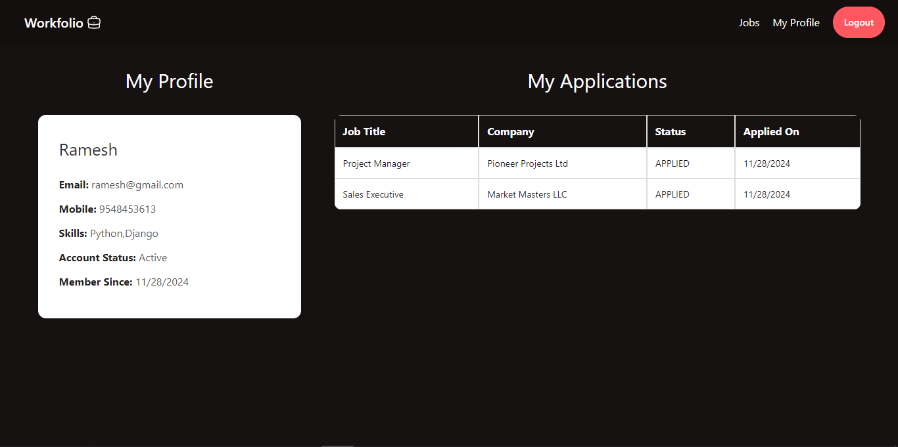

# **Workfolio: An Online Job Portal**

**Workfolio** is a comprehensive full-stack web application built to connect job seekers and employers seamlessly. The platform facilitates efficient job searching, application management, and admin application management, ensuring a user-friendly experience for both job seekers and recruiters.

---
## Technology Stack:

- **Frontend**: **ReactJS** with **DaisyUI** for modern and responsive design.
- **Backend**: **Spring Boot** for robust business logic and API handling.
- **Database**: **MySQL** for secure and scalable data management.
## Key Features:

- **Job Posting**: Discover job opportunities by category, location, or company.
- **User Profiles**: Build and customize personal profiles with contact information, experience, and skill set.
- **Job Applications**: Apply to jobs directly, with application tracking.
- **Admin Dashboard**: Manage job postings, review applications, and oversee platform activity.
- **Secure User Authentication**: Features JWT-based secure login and registration for both users and administrators.

---
## Software Requirements:

- **Java Development Kit (JDK):** Version 17 or higher (required for Spring Boot)
- **Node.js:** Version 18.x or higher (for React development and running npm scripts)
- **MySQL:** Version 8.x (or Docker for containerized database)
- **Development Tools:**
    - **IDE for Backend:** IntelliJ IDEA, Eclipse, or VS Code with Java extensions
    - **IDE for Frontend:** VS Code (preferred for React development)
- **Build Tools:** Maven (comes pre-configured with Spring Boot) and npm/yarn for React.
- **API Testing Tools:** Postman or a similar API client (optional).

---
## Project Setup:

### 1. Clone the Repository

Clone the repository to your local machine using Git:

```bash
git clone https://github.com/NotHumanFF/Online-Job-Portal-With-AI.git
```

### 2. Configuring Application

To configure the application, open the `application.properties` file located in the `backend` folder. Replace the MySQL database credentials with yours:

```properties
spring.datasource.url=jdbc:mysql://<hostname>:<port>/<database_name>
spring.datasource.username=<your_username>
spring.datasource.password=<your_password>
```

### 3. Setting up Frontend

#### Install Dependencies for React and Run Server:

Navigate to the `frontend` directory and install the necessary Node.js dependencies:

```bash
cd your-Project-folder/frontend
npm install
npm start
```

Your React app will be running at [http://localhost:3000](http://localhost:3000).

### 4. Setting up Backend

#### Install dependencies for Spring Boot and Run Server:

Navigate to the `backend` directory and use Maven to install the required dependencies:

```bash
cd your-Project-folder/backend
mvn clean install
mvn spring-boot:run
```

Your Spring Boot API will be available at [http://localhost:8080](http://localhost:8080).

And all set.

---

## Screenshots of Application

### Home Page
            


### User's Page

          

### Login & Registration Page

         


### Admin Dashboard Pages

            


---

## **UML Diagram**

Below is the UML diagram that illustrates the architecture and relationships of the **Workfolio** application:

 


---

## Contributing to Workfolio

We encourage contributions to help enhance and grow the functionality of **Workfolio**. To contribute, please follow these steps:

- **Fork the repository**: This creates a personal copy of the repository under your GitHub account, allowing you to make changes without affecting the original project.
    
- **Create a new branch**:  which helps keep the `main` branch clean and stable.
    
- **Commit your changes**: After making the necessary changes, commit them to the branch you've created.
    
- **Push your changes**: Once you've committed your changes, push them to your forked repository on GitHub.
    
- **Create a pull request**: After pushing the changes, open a pull request (PR) to the original repository.

---

